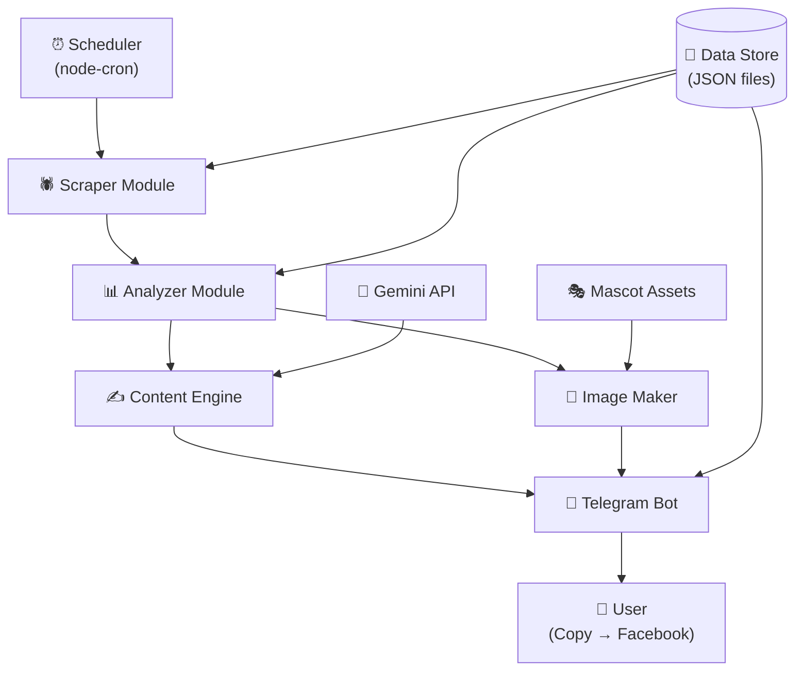

# 📐 Rakuten Hunter V1 — Basic Design

> **Ngày:** 2026-06-30  
> **Trạng thái:** Chờ duyệt  
> **Phiên bản:** V1 (Telegram → Manual Post)

---

## 1. Tổng quan kiến trúc

### 1.1 Modules chính



### 1.2 Module Responsibilities

| Module | Trách nhiệm | Input | Output |
|--------|-------------|-------|--------|
| **Scraper** | Quét các trang Rakuten, extract product data | URLs config | `ScrapedProduct[]` |
| **Analyzer** | Chấm điểm deal, lọc top, dedup | `ScrapedProduct[]` | `ScoredDeal[]` |
| **ContentEngine** | Sinh bài đăng FB + message bạn bè bằng AI | `ScoredDeal` | `GeneratedContent` |
| **ImageMaker** | Tạo ảnh promo: mascot + product info | `ScoredDeal` + mascot assets | `Buffer (PNG)` |
| **TelegramBot** | Gửi content hoàn chỉnh vào channel | `GeneratedContent` + `Image` | Telegram message |

---

## 2. Data Models

### 2.1 ScrapedProduct

```javascript
const ScrapedProduct = {
  id: "",                  // Hash từ itemUrl (dedup key)
  itemUrl: "",             // URL gốc trên Rakuten
  itemName: "",            // Tên sản phẩm (JP)
  shopName: "",            // Tên shop
  imageUrl: "",            // URL ảnh sản phẩm
  genre: "",               // gia_dung | thuc_pham | my_pham | quan_ao_tre_em | do_choi_tre_em
  currentPrice: 0,         // Giá hiện tại (円)
  originalPrice: null,     // Giá gốc (null nếu không có)
  discountPercent: 0,      // % giảm giá
  pointRate: 0,            // % point back (Super DEAL)
  pointAmount: 0,          // Số point nhận được
  isSuperDeal: false,      // Flag Super DEAL
  reviewCount: 0,          // Số review
  reviewAverage: 0.0,      // Điểm review TB (0-5)
  dealEndTime: null,       // Thời hạn deal (ISO string)
  scrapedAt: "",           // Thời gian scrape
  sourcePage: "",          // superdeal | search | ranking
};
```

### 2.2 ScoredDeal

```javascript
const ScoredDeal = {
  ...ScrapedProduct,
  score: 0,                // 0-100
  scoreBreakdown: { discount: 0, point: 0, review: 0, priceRange: 0, urgency: 0 },
  effectivePrice: 0,       // Giá sau point back
  savings: 0,              // Tiết kiệm (円)
  savingsPercent: 0,       // % tiết kiệm tổng
};
```

### 2.3 GeneratedContent

```javascript
const GeneratedContent = {
  dealId: "",
  facebookPost: "",        // Bài FB (copy-ready, có【PR】)
  friendMessage: "",       // Message bạn bè
  hashtags: [],
  productLink: "",         // Link SP (V2: ROOM link)
  generatedAt: "",
};
```

---

## 3. Module Interfaces

### 3.1 Scraper
```javascript
async function scrapeAll(config) → ScrapedProduct[]
async function scrapeTarget(targetName, options) → ScrapedProduct[]
```

### 3.2 Analyzer
```javascript
function scoreDeals(products) → ScoredDeal[]         // Sort by score desc
function filterDeals(deals, threshold, maxDeals) → ScoredDeal[]
function isDuplicate(dealId) → boolean
```

### 3.3 ContentEngine
```javascript
async function generateContent(deal) → GeneratedContent    // 1 deal
async function generateBatch(deals) → GeneratedContent[]   // Nhiều deals
```

### 3.4 ImageMaker
```javascript
async function createPromoImage(deal, mascotPose) → Buffer  // PNG
function selectMascotPose(deal) → string                    // Auto-select pose
```

### 3.5 TelegramBot
```javascript
async function sendDeal(deal, content, image) → void
async function sendDailySummary(todayDeals) → void
```

---

## 4. Scraping Targets

| # | Target | URL | Tần suất |
|---|--------|-----|----------|
| 1 | **Super DEAL** | `event.rakuten.co.jp/superdeal/` | Mỗi 3h |
| 2 | **Search "半額"** | `search.rakuten.co.jp/search/mall/半額/` | Mỗi 4h |
| 3 | **Search "タイムセール"** | `search.rakuten.co.jp/search/mall/タイムセール/` | Mỗi 4h |
| 4 | **Ranking** | `ranking.rakuten.co.jp/` | 1 lần/ngày |
| 5 | **Category search** | `search.rakuten.co.jp/search/mall/?g=GENRE_ID` | Mỗi 6h |

### Genre IDs

| Category | Genre ID | Keywords |
|----------|----------|----------|
| Gia dụng | `100804` | キッチン, 掃除, 収納 |
| Thực phẩm | `100227` | お菓子, ドリンク, 米 |
| Mỹ phẩm | `100939` | スキンケア, メイク |
| Quần áo trẻ em | `100533` | 子供服, ベビー服 |
| Đồ chơi trẻ em | `101164` | 知育玩具, ゲーム |

---

## 5. Scoring System

```
Max 100 points:
  Discount %     → max 30 pts
  Point Back     → max 25 pts
  Review Quality → max 20 pts
  Price Range    → max 15 pts
  Urgency        → max 10 pts

Thresholds:
  >= 70  → Gửi Telegram
  >= 85  → "🔥 DEAL SIÊU HOT"
```

---

## 6. AI Content (Google Gemini)

| Config | Value |
|--------|-------|
| Provider | Google Gemini API |
| Model | `gemini-2.0-flash` |
| SDK | `@google/generative-ai` |
| Output language | Tiếng Việt (tên SP giữ JP) |
| Output | 2 versions: FB post + Friend message |

---

## 7. Mascot Image System

### 5 Poses

| Pose | File | Trigger |
|------|------|---------|
| Chỉ tay | `mascot_pointing.png` | Default |
| Hào hứng | `mascot_excited.png` | Score >= 85 |
| Ngạc nhiên | `mascot_surprised.png` | Discount >= 50% |
| Nháy mắt | `mascot_winking.png` | Point >= 30% |
| Chào mời | `mascot_inviting.png` | Có deadline |

### Image: 1200x628px (Facebook optimal)
```
Layers: Background gradient → Product image (250x250)
        → Deal badge → Price/Review text
        → CTA bar → Mascot (bottom-right, 200x250)
```

**Yêu cầu mascot:** PNG, transparent background, ~400x500px

---

## 8. Tech Stack

| Component | Choice | Reason |
|-----------|--------|--------|
| Language | Node.js | Tái sử dụng telegram-notifier |
| AI | Google Gemini | User có Ultra account |
| Scraping | Cheerio + Playwright (backup) | Nhẹ + JS render |
| Image | node-canvas | Composite từ code |
| Data | JSON files | Đơn giản cho V1 |
| Scheduler | node-cron | Đã có sẵn |
| Telegram | node-telegram-bot-api | Đã có, đã test |
